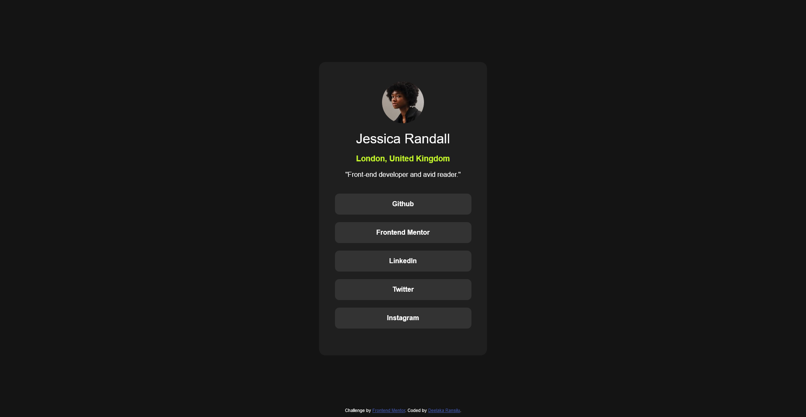

# Frontend Mentor - Social links profile solution

This is a solution to the [Social links profile challenge on Frontend Mentor](https://www.frontendmentor.io/challenges/social-links-profile-UG32l9m6dQ). Frontend Mentor challenges help you improve your coding skills by building realistic projects.

## Table of contents

- [Overview](#overview)
  - [The challenge](#the-challenge)
  - [Screenshot](#screenshot)
  - [Links](#links)
- [My process](#my-process)
  - [Built with](#built-with)
  - [What I learned](#what-i-learned)
  - [Continued development](#continued-development)
- [Acknowledgments](#acknowledgments)

## Overview

### The challenge

Users should be able to:

- See hover and focus states for all interactive elements on the page

### Screenshot



### Links

- Solution URL: [Add solution URL here](https://your-solution-url.com)
- Live Site URL: [Add live site URL here](https://your-live-site-url.com)

## My process

### Built with

- Semantic HTML5 markup
- CSS custom properties
- Flexbox

### What I learned

While working on this project, I learned how to effectively use **media queries** to make the design responsive across different screen sizes. Here's an example:

```css
@media (max-width: 600px) {
  .container {
    flex-direction: column;
  }
}
```

I also gained a better understanding of CSS **transitions**, which I used to create smooth hover effects. For example:

```css
.button {
  transition: background-color 0.3s ease, transform 0.3s ease;
}

.button:hover {
  background-color: #ff6347;
  transform: scale(1.1);
}
```

These concepts were crucial in improving the interactivity and responsiveness of the project.

### Continued development

In future projects, I want to focus on:

- **Advanced CSS Animations:** Improving my skills in creating more complex animations using `@keyframes` and mastering animation libraries like GSAP for more dynamic effects.
- **Accessibility (a11y):** Ensuring my projects are accessible to all users by adhering to web accessibility guidelines and implementing proper ARIA attributes.
- **Responsive Design Techniques:** Refining my approach to building layouts that adapt seamlessly to various screen sizes, including experimenting with new CSS features like `clamp()`, `min()`, and `max()`.
- **JavaScript Interactivity:** Adding more interactive functionality to my pages, such as dynamic content updates and modal implementations.
- **Performance Optimization:** Exploring techniques to optimize CSS and media query performance, especially for large projects.

By continuing to develop in these areas, I aim to create even more polished and user-friendly projects.

## Acknowledgments

I’d like to thank **Frontend Mentor** for providing this challenge, which pushed me to improve my coding skills and explore new concepts.

Additionally, I want to acknowledge the helpful community on **Frontend Mentor forums**, where I found inspiration and tips while tackling certain parts of the project.

I completed this project independently and learned a lot throughout the process!
